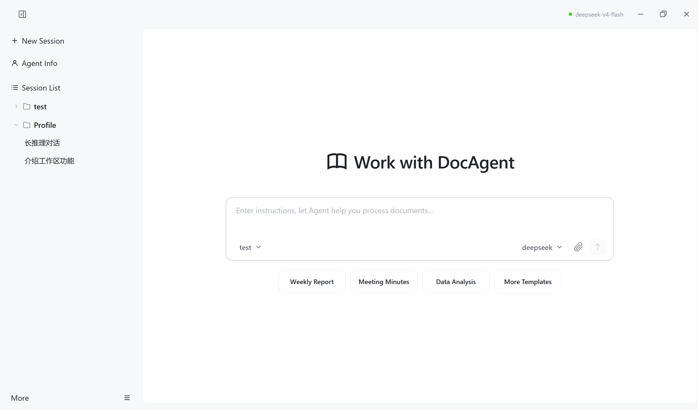

# DocAgent

[English](./README.md) | [简体中文](./README_zh.md)

## Installation

Download the latest Windows installer from [Releases](https://github.com/XuMingKe-06/DocAgent/releases) and run it to install.

## Features

### AI Chat & Document Processing
- Multi-turn conversational document operations
- Real-time streaming of AI thoughts and results
- Visual workflow timeline showing each step
- Live code execution preview

### Multiple AI Models
- OpenAI-compatible API, Anthropic Claude, Google Gemini, Ollama local models
- Custom API endpoint support
- Health monitoring with auto-recovery
- Real-time token usage tracking

### Workspace Management
- Multiple workspaces mapped to local directories
- File tree browsing and search
- Create, delete, rename files within workspaces
- Auto-detection when directories are deleted

### Document Processing
- Word (.docx): read, create, edit, format conversion, structure analysis
- Excel (.xlsx): read, create, edit, data extraction
- PPT (.pptx): read, create, edit, slide extraction
- PDF: text extraction
- Markdown / Plain Text: read and convert
- Python code: sandboxed execution with plotting and data analysis support

### Version History
- Automatic version snapshots on file changes
- Configurable retention policy (by count or days)
- Version history browsing with diff comparison
- One-click rollback

### Session Management
- Switch between multiple sessions
- AI continues running in background after switching
- Auto-generated session titles

### Prompt Templates
- Built-in templates for common tasks
- Custom templates with variables
- Category-based organization

### User Experience
- Dark / Light / System theme
- Chinese / English interface
- Global shortcuts (Ctrl+N new session, Ctrl+W close, Ctrl+B sidebar, Ctrl+, settings)
- File attachment upload (images, documents, text)
- Automatic update detection and installation

## Environment Variables

| Variable | Description |
|----------|-------------|
| `DOCAGENT_PYTHON` | Specify Python interpreter path (auto-detected by default) |
| `TAURI_DEV_HOST` | Dev host address |

## Notes

- `builtin_provider.json` contains API keys and is gitignored
- Configure API keys in app settings
- Python document engine timeout defaults to 120 seconds
