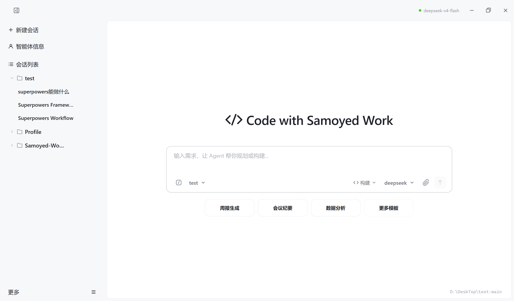
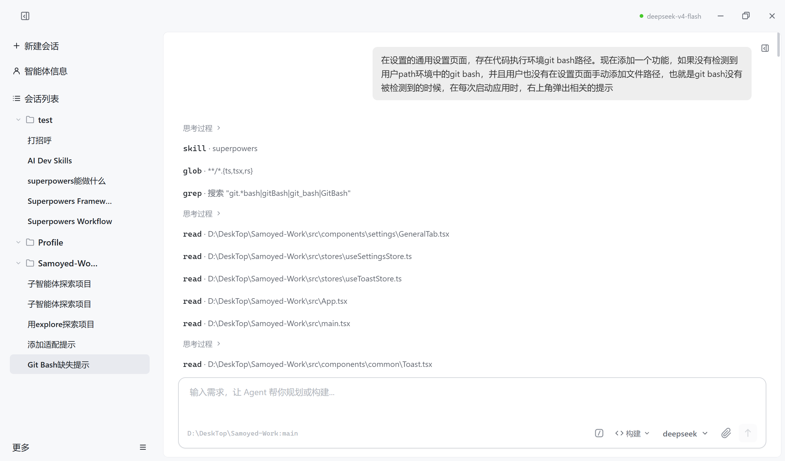
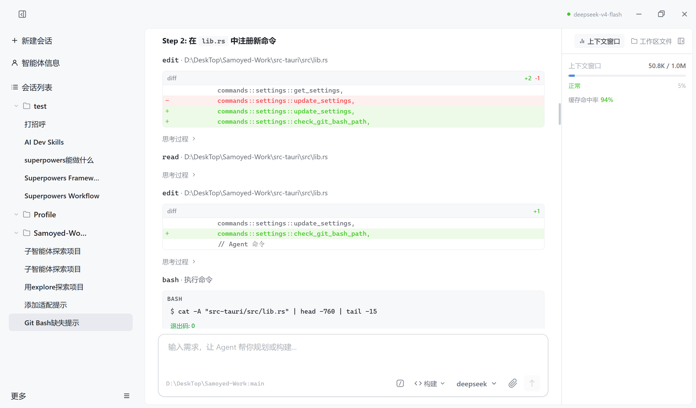

# Samoyed Work

[简体中文](./README_zh.md) | [English](./README.md)

## 安装

从 [GitHub Releases](https://github.com/light-misty/Samoyed-Work/releases) 下载最新版本 Windows 安装包，运行即可完成安装。

## 核心功能

### AI 智能体
- 多模式 Agent（计划/编码/文档三种模式），自主执行任务
- SubAgent 工作流，自动分解复杂任务为子任务协同完成
- 只读探索模式，安全地浏览和分析项目代码
- LSP 语言服务器集成，提供实时代码诊断与分析
- 权限控制系统，精细化管理文件与命令操作
- 可扩展 Skill 系统，支持加载自定义能力
- 内置 Superpowers 技能开发工作流框架
- 多轮对话式操作，AI 自主调用工具完成你的需求
- 实时流式输出 AI 的思考过程和结果
- 工作流时间线可视化，清晰展示 AI 的每一步操作
- 代码执行过程实时预览

### 支持多种 AI 模型
- OpenAI 兼容接口、Anthropic Claude、Google Gemini、Ollama 本地模型
- 支持自定义接口地址
- AI 服务健康状态实时检测，断线自动恢复
- Token 用量实时监控

### 工作区管理
- 支持多个工作区，每个工作区对应电脑上的一个目录
- 文件树浏览、文件搜索
- 可直接在工作区内创建、删除、重命名文件
- 目录被删除时自动检测并清理
- 显示工作区 Git 仓库状态

### 文档处理（Document 模式）
- Word（.docx）：读取、创建、编辑、转换格式、分析结构
- Excel（.xlsx）：读取、创建、编辑、提取数据
- PPT（.pptx）：读取、创建、编辑、提取幻灯片
- PDF：文字提取
- Markdown / 纯文本：读取与转换
- Markdown 预览支持内链跳转、数学公式和表情渲染
- Markdown 预览支持本地相对路径图片加载
- 文档预览重构为独立页面模式，完善多格式支持

### 会话管理
- 多会话切换，互不干扰
- 切换会话后 AI 仍在后台运行
- AI 自动为会话生成标题
- 会话待办任务功能
- 会话列表分页，支持大量历史会话

### 提示词模板
- 内置多种常用模板
- 支持自定义模板和变量
- 按分类管理

### 界面与体验
- 深色模式 / 浅色模式 / 跟随系统
- 中文 / 英文界面
- 全局快捷键（Ctrl+N 新建会话、Ctrl+W 关闭、Ctrl+B 切换侧栏、Ctrl+, 设置）
- 支持上传图片、文档等附件
- 图片文件预览功能，支持缩放操作
- 自动检测更新并安装

